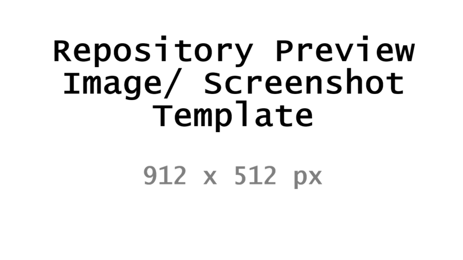

<!--
This file is part of YOUR_PROJECT_TITLE
README.md
Author(s): Gabriel Mongefranco
Created: 2026-01-01
Last Modified: 2026-09-05
Summary: Provides an overview of the project, in Markdown format.
Notes: See README file for documentation and full license information.

Copyright © YOUR_YEAR Gabriel Mongefranco

This program is free software: you can redistribute it and/or modify
it under the terms of the GNU General Public License as published by
the Free Software Foundation, either version 3 of the License, or (at your option) any later version.
This program is distributed in the hope that it will be useful,
but WITHOUT ANY WARRANTY; without even the implied warranty of
MERCHANTABILITY or FITNESS FOR A PARTICULAR PURPOSE. See the
GNU General Public License for more details.
You should have received a copy of the GNU General Public License along
with this program. If not, see <https://www.gnu.org/licenses/>.

-->
> [!NOTE]
> # Gabriel Mongefranco's Repo Template
> Copyright © 2026 Gabriel Mongefranco. Based on [@DepressionCenter/EFDC-Repo-Template](https://github.com/DepressionCenter/EFDC-Repo-Template) (GPLv3/FDL).
> ## **Template Setup Instructions (Delete this block when done)**
> + Click the **"Use this template"** button, or download or fork this repo.
> + Then, do a global **Find and Replace All** (Ctrl+Shift+H or Cmd+Shift+H) across all project files for the following variables:
>   * `YOUR_PROJECT_TITLE` → e.g., `Sleep Data Analyzer`
>   * `YOUR_REPO_NAME` → e.g., `sleep-data-analyzer` (no spaces, used for URLs)
>   * `YOUR_YEAR` → e.g., `2026`
>   * `YOUR_DOI` → e.g., `10.5281/zenodo.xxxxxxx` (or delete if not yet assigned)
> + Manually edit these sections:
>   1. `README.md` → Description section and Credits section
>   2. `CITATION.cff` → `authors:` block
>   3. `.zenodo.json` → `creators:` block
> + When done, delete the setup instructions but keep the template attribution above.

# YOUR_PROJECT_TITLE

## Description
YOUR_PROJECT_TITLE is a < program/library/collection of scripts > for < description of what it does and what problem it solves >.

< List of key features, or a few sentences about what makes this project unique >.

## Quick Start Guide
+ < Short compile/run instructions, without too much detail >

## Documentation
+ **Complete documentation:** See the [`/docs`](./docs) folder in this repository for setup guides, usage examples, architecture, and technical details.

## Additional Resources
+ < Links to study website, related projects, etc. >

## About the Author

YOUR_PROJECT_TITLE is built by [Gabriel Mongefranco](https://gabriel.mongefranco.com), a database and
software architect who has spent two decades building data platforms in healthcare and
research — enterprise data warehouses, BI systems, knowledge bases, and the first architecture for mobile and
wearable research data at a large research university.

Learn more at: [Gabriel Mongefranco's website](https://gabriel.mongefranco.com).

## Contact

Questions, bug reports, enhancement ideas and requests are welcome as GitHub issues. Feel
free to send pull requests as well!

## Credits
### Authors:
+ [Gabriel Mongefranco](https://gabriel.mongefranco.com) [(@gabrielmongefranco)](https://github.com/gabrielmongefranco)
+ Name [ @githubusername ]( link to github profile or website )
+ Name [ @githubusername ]( link to github profile or website )
+ [ Name ]( link to profile or website ) [ @githubusername ]( link to github profile )
+ [ Name ]( link to profile or website ) [ @githubusername ]( link to github profile )

### Contributors:
+ Name [ @githubusername ]( link to github profile or website )
+ Name [ @githubusername ]( link to github profile or website )
+ [ Name ]( link to profile or website ) [ @githubusername ]( link to github profile )
+ [ Name ]( link to profile or website ) [ @githubusername ]( link to github profile )

#### This work is based in part on the following projects, libraries and/or studies:
+ None
+ __OR__ < Library_or_project_name > : < what_it_does.  How_it_is_used_in_this_project. > License: < license >. < link >

## License
### Copyright Notice
Copyright © YOUR_YEAR Gabriel Mongefranco

### Software and Library License Notice
This program is free software: you can redistribute it and/or modify it under the terms of the GNU General Public License as published by the Free Software Foundation, either version 3 of the License, or (at your option) any later version.

This program is distributed in the hope that it will be useful, but WITHOUT ANY WARRANTY; without even the implied warranty of MERCHANTABILITY or FITNESS FOR A PARTICULAR PURPOSE. See the GNU General Public License for more details.

You should have received a copy of the GNU General Public License along with this program. If not, see <https://www.gnu.org/licenses/gpl-3.0-standalone.html>.

### Documentation License Notice
Permission is granted to copy, distribute and/or modify this document 
under the terms of the GNU Free Documentation License, Version 1.3 
or any later version published by the Free Software Foundation; 
with no Invariant Sections, no Front-Cover Texts, and no Back-Cover Texts. 
You should have received a copy of the license included in the section entitled "GNU 
Free Documentation License". If not, see <https://www.gnu.org/licenses/fdl-1.3-standalone.html>

## Citation
If you find this repository, code or paper useful for your research, please cite it.

#### Citation Example:
>_Mongefranco, Gabriel (YOUR_YEAR). YOUR_PROJECT_TITLE. Software. https://github.com/gabrielmongefranco/YOUR_REPO_NAME_
​​​​​​​     _DOI: [YOUR_DOI](https://doi.org/YOUR_DOI)_

#### __OPTIONAL__ Release History and DOI #:
* 2026-01-01: v1.0. [< DOI # e.g. 10.6084/m9.figshare.xxxxxx.v1 >](https://doi.org/...)
* 2026-06-30: v1.5. [< DOI # e.g. 10.6084/m9.figshare.xxxxxx.v1_5 >](https://doi.org/...)
* 2026-12-01: v2.0. [< DOI # e.g. 10.6084/m9.figshare.xxxxxx.v2 >](https://doi.org/...)

----

Copyright © YOUR_YEAR Gabriel Mongefranco
